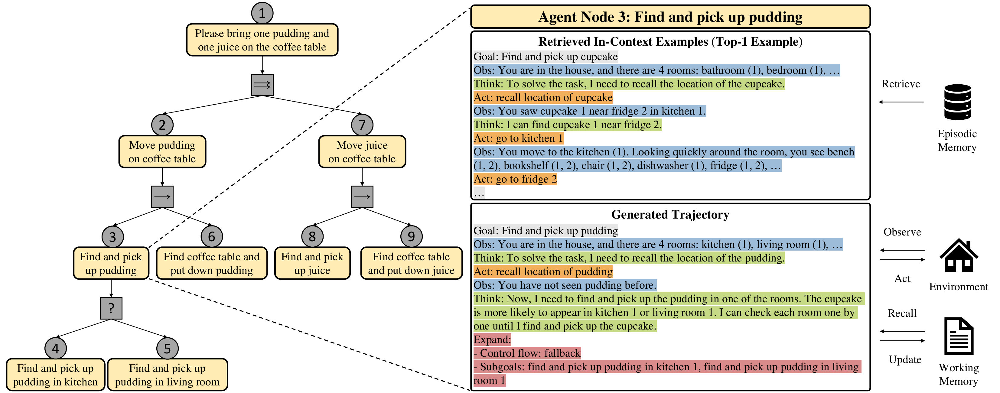
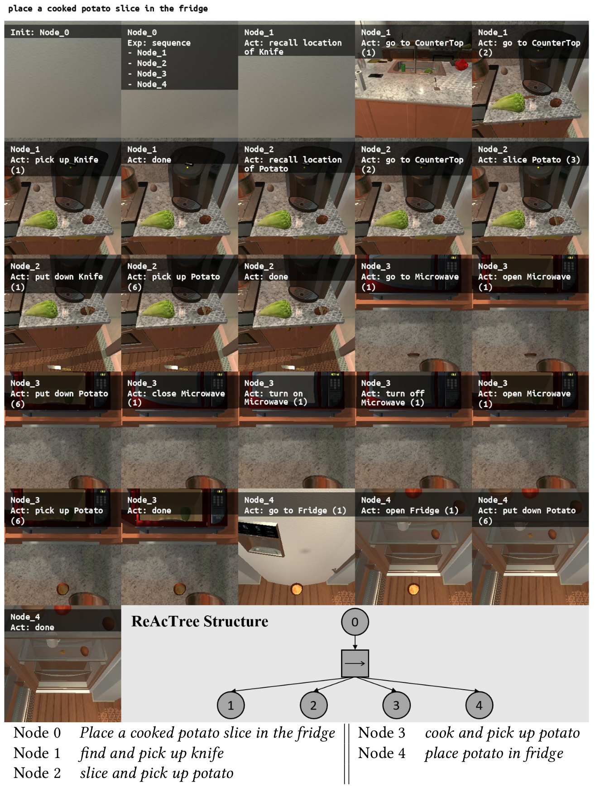

# ReAcTree: Hierarchical LLM Agent Trees with Control Flow for Long-Horizon Task Planning

### Accepted to AAMAS 2026 (Full Paper)

### [Paper (arXiv)](https://arxiv.org/abs/2511.02424) | [Project Page](https://choi-jaewoo.github.io/ReAcTree/)

[Jae-Woo Choi](https://choi-jaewoo.github.io/)<sup>1, 2</sup>, Hyungmin Kim <sup>2</sup>, Hyobin Ong<sup>2</sup>, [Youngwoo Yoon](https://sites.google.com/view/youngwoo-yoon/)<sup>1, 2</sup>, Minsu Jang<sup>1, 2</sup>, Dohyung Kim<sup>1, 2</sup>, Jaehong Kim<sup>1</sup>

<sup>1</sup> Electronics and Telecommunications Research Institute, <sup>2</sup> University of Science and Technology 


Here is the official implementation of **ReAcTree**, a hierarchical task-planning framework designed to solve complex, long-horizon tasks. Instead of relying on a single, monolithic trajectory, ReAcTree dynamically constructs an agent tree by decomposing a complex goal into manageable subgoals. This tree is composed of **LLM agent nodes**—which can reason, act, and further expand the tree —and **control flow nodes** (e.g., sequence, fallback, parallel)  that coordinate the execution strategy. The framework is supported by two complementary memory systems: **episodic memory** to retrieve relevant subgoal-level examples for in-context learning and **working memory** to share environmental observations (like object locations) across all nodes. ReAcTree was validated on the WAH-NL and ALFRED benchmarks , where it consistently and significantly outperformed strong baselines like ReAct.

<p align="center">
  
  <br>
</p>
<br>


## Environment

Ubuntu 14.04+ is required. The scripts were developed and tested on Ubuntu 22.04 and Python 3.8.

You can use WSL-Ubuntu on Windows 10/11.

## Install

1. Clone the whole repo.
    ```bash
    $ git clone {repo_url}
    ```

1. Setup a virtual environment.
    ```bash
    $ conda create -n {env_name} python=3.8
    $ conda activate {env_name}
    ```

1. Install PyTorch (2.3.1) first (see https://pytorch.org/get-started/locally/).
    ```bash
    # exemplary install command for PyTorch 2.3.1 with CUDA 11.8
    $ pip install torch==2.3.1 torchvision==0.18.1 torchaudio==2.3.1 --index-url https://download.pytorch.org/whl/cu118
    ```

1. Install python packages in `requirements.txt`.
    ```bash
    $ pip install -r requirements.txt
    ```

## Prepare Environments
1. Prepare VirtualHome simulator v.2.2.2
    ```bash
    $ cd {project_root}/virtualhome/simulation/unity_simulator/
    $ wget http://virtual-home.org//release/simulator/v2.0/v2.2.2/linux_exec.zip
    $ unzip linux_exec.zip
    ```
1. Prepare ALFRED dataset
    ```bash
    $ cd {project_root}/alfred/data
    $ sh download_data.sh json
    ```


## Experiments on WAH-NL
### 1. Evaluation
1. Open a new terminal and run VirtualHome simulator

```bash
$ cd {project_root}
$ ./virtualhome/simulation/unity_simulator/linux_exec.x86_64
```

2. Open a new terminal and evaluate

```bash
$ cd {project_root}
$ python src/evaluate.py --config-name=wah_reactree exp_type=evaluate llm_agent.model_name=meta-llama/Meta-Llama-3.1-8B llm_agent.working_memory=True prompt.sys_prompt_root_dir=resource/wah/sys_prompt prompt.ic_ex_root_dir=resource/wah/em_llm llm_agent.ic_ex_select_type=rag llm_agent.max_steps=199 llm_agent.max_decisions=199 
```

### 2. Evaluation Using Headless Environment
1. Open a new terminal and run Xserver

```bash
# requires sudo permission
$ cd {project_root}/virtualhome
$ sudo python3 helper_scripts/startx.py $display_num
```

2. Open another terminal and run unity simulator

```bash
$ cd {project_root}/virtualhome
$ DISPLAY=:$display_num ./simulation/unity_simulator/linux_exec.x86_64 -batchmode
```

3. Open another terminal and evaluate

```bash
$ python src/evaluate.py --config-name=wah_headless_reactree exp_type=evaluate llm_agent.model_name=meta-llama/Meta-Llama-3.1-8B llm_agent.working_memory=True prompt.sys_prompt_root_dir=resource/wah/sys_prompt prompt.ic_ex_root_dir=resource/wah/em_llm llm_agent.ic_ex_select_type=rag llm_agent.max_steps=199 llm_agent.max_decisions=199 
```

### 3. (Optional) Collect and Embed Human Trajectories
- Open a new terminal and collect human trajectories

```bash
$ cd {project_root}
$ python src/collect_human.py --config-name=wah_reactree llm_agent.working_memory=True dataset.collect_ex_root_dir=resource/wah
```

- After collecting human trajectories, embed the trajectories

```bash
$ cd {project_root}
$ python src/embed_em.py --config-name=wah_reactree exp_type=embed_em llm_agent.working_memory=True dataset.embedding_root_dir='resource/wah/collect_human' dataset.em_root_dir='resource/wah/em_human'
```

### 4. (Optional) Bootstrap and Embed LLM Trajectories
- Open a new terminal and collect llm trajectories

```bash
$ cd {project_root}
$ python src/collect_llm.py --config-name=wah_reactree exp_type=collect_llm llm_agent.model_name=meta-llama/Meta-Llama-3.1-70B llm_agent.working_memory=True dataset.collect_ex_root_dir=resource/wah prompt.sys_prompt_root_dir=resource/wah/sys_prompt prompt.ic_ex_root_dir=resource/wah/em_human llm_agent.ic_ex_select_type=rag llm_agent.max_steps=199 llm_agent.max_decisions=199 
```

- After bootstrapping, embed the trajectories

```bash
$ cd {project_root}
$ python src/embed_em.py --config-name=wah_reactree exp_type=embed_em llm_agent.working_memory=True dataset.embedding_root_dir=resource/wah/collect_llm dataset.em_root_dir=resource/wah/em_llm
```

### 5. Success case of ReAcTree on WAH-NL 

<p align="center">
  
  <br>
</p>
<br>

## Experiments on ALFRED
### 1. Evaluation
1. Open a new terminal and evaluate

```bash
$ cd {project_root}
$ python src/evaluate.py --config-name=alfred_reactree exp_type=evaluate dataset.eval_set=valid_seen llm_agent.model_name=meta-llama/Meta-Llama-3.1-8B llm_agent.working_memory=True prompt.sys_prompt_root_dir=resource/alfred/sys_prompt prompt.ic_ex_root_dir=resource/alfred/em_llm llm_agent.ic_ex_select_type=rag llm_agent.max_steps=100 llm_agent.max_decisions=100
```

### 2. Evaluation Using Headless Environment
1. Please run `startx.py` script before running ALFRED experiment on headless servers. Below script uses 1 for the X_DISPLAY id, but you can use different ids such as 0.

```bash
# requires sudo permission
$ sudo python3 alfred/scripts/startx.py 1
```

### 3. (Optional) Collect and Embed Human Trajectories
- Open a new terminal and collect human trajectories

```bash
$ cd {project_root}
$ python src/collect_human.py --config-name=alfred_reactree llm_agent.working_memory=True dataset.collect_ex_root_dir=resource/alfred
```

- After collecting human trajectories, embed the trajectories

```bash
$ cd {project_root}
$ python src/embed_em.py --config-name=alfred_reactree llm_agent.working_memory=True dataset.embedding_root_dir='resource/alfred/collect_human' dataset.em_root_dir='resource/alfred/em_human'
```

### 4. (Optional) Bootstrap and Embed LLM Trajectories
- Open a new terminal and collect llm trajectories

```bash
$ cd {project_root}
$ python src/collect_llm.py --config-name=alfred_reactree exp_type=collect_llm llm_agent.model_name=meta-llama/Meta-Llama-3.1-8B llm_agent.working_memory=True dataset.collect_ex_root_dir=resource/alfred prompt.sys_prompt_root_dir=resource/alfred/sys_prompt prompt.ic_ex_root_dir=resource/alfred/em_human llm_agent.ic_ex_select_type=rag llm_agent.max_decisions=100 alfred.diverse_task=True 
```

- After bootstrapping, embed the trajectories

```bash
$ cd {project_root}
$ python src/embed_em.py --config-name=alfred_reactree dataset.check_success=True llm_agent.working_memory=True dataset.embedding_root_dir='resource/alfred/collect_llm' dataset.em_root_dir='resource/alfred/em_llm'
```

### 5. Success case of ReAcTree on ALFRED 
<p align="center">
  
  <br>
</p>
<br>


## FAQ

* Running out of disk space for Huggingface models
  * You can set the cache folder to be in another disk.
    ```bash
    $ export TRANSFORMERS_CACHE=/mnt/otherdisk/.hf_cache/
    ```

* I have encountered 'cannot find X server with xdpyinfo' in running ALFRED experiments.
  * Please try another x_display number (this should be a string; e.g., '1') in the config file.
    ```bash
    $ python src/evaluate.py --config-name=config_alfred alfred.x_display='1'
    ```

* I am encountering a Huggingface authentication error during evaluation.
  * You need to log in using the huggingface-cli first. Open a new terminal, log in, and then run your evaluation.
    ```bash
    $ huggingface-cli login
    $ cd {project_root}
    $ python src/evaluate.py --config-name=wah_reactree exp_type=evaluate llm_agent.model_name=meta-llama/Meta-Llama-3.1-8B llm_agent.working_memory=True prompt.sys_prompt_root_dir=resource/wah/sys_prompt prompt.ic_ex_root_dir=resource/wah/em_llm llm_agent.ic_ex_select_type=rag llm_agent.max_steps=199 llm_agent.max_decisions=199
    ```

## Citation

```bibtex
@misc{choi2025reactreehierarchicalllmagent,
      title={ReAcTree: Hierarchical LLM Agent Trees with Control Flow for Long-Horizon Task Planning}, 
      author={Jae-Woo Choi and Hyungmin Kim and Hyobin Ong and Minsu Jang and Dohyung Kim and Jaehong Kim and Youngwoo Yoon},
      year={2025},
      eprint={2511.02424},
      archivePrefix={arXiv},
      primaryClass={cs.AI},
      url={https://arxiv.org/abs/2511.02424}, 
}
```
